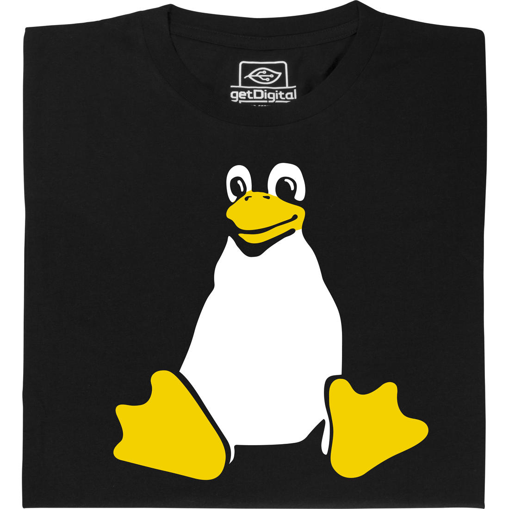

# markdown-cheatsheet-2021 

This repository contains collection of syntax on markdown markup language :fire:


## Headings

**Markdown :computer:**

``` markdown

# H1
## H2
### H3
#### H4
##### H5 
###### H6


This is also H1
===============

This is also H2
---------------

```

**Output :globe_with_meridians:**

<h1>H1</h1>
<h2>H2</h2>
<h3>H3</h3>
<h4>H4</h4>
<h5>H5</h5>
<h6>H6</h6>

<h1>This is also H1</h1>
<h2>This is also H2</h2>

<br>

Markdown applications don’t agree on how to handle a missing space between the number signs (#) and the heading name. For compatibility, always put a space between the number signs and the heading name.

| :white_check_mark: Do this      | :negative_squared_cross_mark: Don't do this  |
| ------------------------------- | -------------------------------------------  |
| # Here's a Heading              | #Here's a Heading                            |

<br>

## Emphasis

<br>

### Bold

**Markdown :computer:**

``` markdown

I just love **bold text**.

I just love __bold text__.

Love**is**bold

```

**Output :globe_with_meridians:**

I just love **bold text**.

I just love __bold text__.

Love**is**bold

<br>

### Italic

**Markdown :computer:**

``` markdown

Italicized text is the *cat's meow*.

Italicized text is the _cat's meow_.

A*cat*meow

```

**Output :globe_with_meridians:**

Italicized text is the *cat's meow*.

Italicized text is the _cat's meow_.

A*cat*meow

<br>

### Bold and Italic

To emphasize text with bold and italics at the same time, add three asterisks or underscores before and after a word or phrase. To bold and italicize the middle of a word for emphasis, add three asterisks without spaces around the letters.

**Markdown :computer:**

``` markdown

This text is ***really important***.

This text is ___really important___.

This text is __*really important*__.	

This text is **_really important_**.

This is really***very***important text.

```

**Output :globe_with_meridians:**

This text is ***really important***.

This text is ___really important___.

This text is __*really important*__.	

This text is **_really important_**.

This is really***very***important text.

<br>
<br>

## Blockquote 

**Markdown :computer:**

``` markdown

> This is a blockquote 

```

**Output :globe_with_meridians:**

> This is a blockquote 

<br>

#### Blockquotes with multiple paragraphs

**Markdown :computer:**

``` markdown

> This is first blockquote 
>
> This is second blockquote 

```

**Output :globe_with_meridians:**

> This is first blockquote 
>
> This is second blockquote 

<br>

#### Nested blockquotes

**Markdown :computer:**

``` markdown

> This is a blockquote 
>
>> This is a nested blockquote 

```

**Output :globe_with_meridians:**

> This is a blockquote 
>
>> This is a nested blockquote 


<br>

#### Blockquotes with other elements

**Markdown :computer:**

``` markdown

> #### The quarterly results look great!
>
> - Revenue was off the chart.
> - Profits were higher than ever.
>
>  *Everything* is going according to **plan**.

```

**Output :globe_with_meridians:**

> #### The quarterly results look great!
>
> - Revenue was off the chart.
> - Profits were higher than ever.
>
>  *Everything* is going according to **plan**.


<br>
<br>

## Lists

<br>

### Ordered list

To create an ordered list, add line items with numbers followed by periods. The numbers don’t have to be in numerical order, but the list should start with the number one.


**Markdown :computer:**

``` markdown

1. First item
2. Second item
3. Third item
4. Fourth item
```

**Output :globe_with_meridians:**

1. First item
2. Second item
3. Third item
4. Fourth item

<br>

**Markdown :computer:**

``` markdown

1. First item
1. Second item
1. Third item
1. Fourth item
```

**Output :globe_with_meridians:**

1. First item
1. Second item
1. Third item
1. Fourth item

<br>

**Markdown :computer:**

``` markdown

1. First item
2. Second item
3. Third item
    1. Indented item
    2. Indented item
4. Fourth item

```

**Output :globe_with_meridians:**

1. First item
2. Second item
3. Third item
    1. Indented item
    2. Indented item
4. Fourth item

<br>
<br>

### Unordered list

To create an unordered list, add dashes, asterisks, or plus signs in front of line items. Indent one or more items to create a nested list.

**Markdown :computer:**

``` markdown

- First item
- Second item
- Third item
- Fourth item

```

**Output :globe_with_meridians:**

- First item
- Second item
- Third item
- Fourth item

<br>

**Markdown :computer:**

``` markdown

+ First item
+ Second item
+ Third item
+ Fourth item

```

**Output :globe_with_meridians:**

+ First item
+ Second item
+ Third item
+ Fourth 

<br>

**Markdown :computer:**

``` markdown

* First item
* Second item
* Third item
* Fourth item

```

**Output :globe_with_meridians:**

* First item
* Second item
* Third item
* Fourth item

<br>

**Markdown :computer:**

``` markdown

- First item
- Second item
- Third item
    - Indented item
    - Indented item
- Fourth item

```

**Output :globe_with_meridians:**

- First item
- Second item
- Third item
    - Indented item
    - Indented item
- Fourth item

<br>
<br>

## Images

**Markdown :computer:**

``` markdown

Format: 



```

**Output :globe_with_meridians:**


<br>
<br>

## Code Blocks

**Markdown :computer:**

``` markdown

``` javascript

console.log("hey");


```

**Output :globe_with_meridians:**

``` javascript

console.log("hey");

```

<br>
<br>

## Horizontal Rule

**Markdown :computer:**

``` markdown

Use three or more asterisks (***), dashes (---)

***

---

```

**Output :globe_with_meridians:**


***

---

<br>
<br>

## Links

**Markdown :computer:**

``` markdown

[Alternative text](link)

[Github](http://github.com)
```

**Output :globe_with_meridians:**

[Github](http://github.com)
